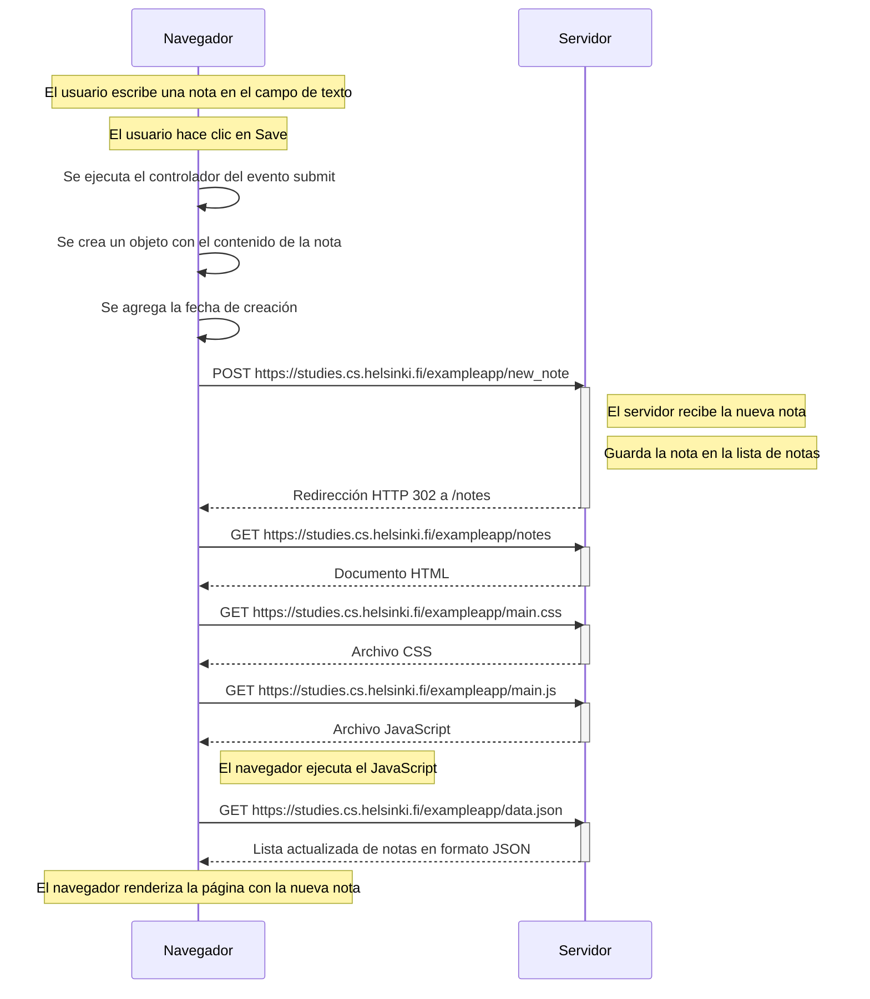

```mermaid
sequenceDiagram
    participant browser as Navegador
    participant server as Servidor

    Note over browser: El usuario escribe una nota en el campo de texto
    Note over browser: El usuario hace clic en Save

    browser->>browser: Se ejecuta el controlador del evento submit
    browser->>browser: Se crea un objeto con el contenido de la nota
    browser->>browser: Se agrega la fecha de creación

    browser->>server: POST https://studies.cs.helsinki.fi/exampleapp/new_note
    activate server
    Note right of server: El servidor recibe la nueva nota
    Note right of server: Guarda la nota en la lista de notas

    server-->>browser: Redirección HTTP 302 a /notes
    deactivate server

    browser->>server: GET https://studies.cs.helsinki.fi/exampleapp/notes
    activate server
    server-->>browser: Documento HTML
    deactivate server

    browser->>server: GET https://studies.cs.helsinki.fi/exampleapp/main.css
    activate server
    server-->>browser: Archivo CSS
    deactivate server

    browser->>server: GET https://studies.cs.helsinki.fi/exampleapp/main.js
    activate server
    server-->>browser: Archivo JavaScript
    deactivate server

    Note right of browser: El navegador ejecuta el JavaScript

    browser->>server: GET https://studies.cs.helsinki.fi/exampleapp/data.json
    activate server
    server-->>browser: Lista actualizada de notas en formato JSON
    deactivate server

    Note over browser: El navegador renderiza la página con la nueva nota
```
