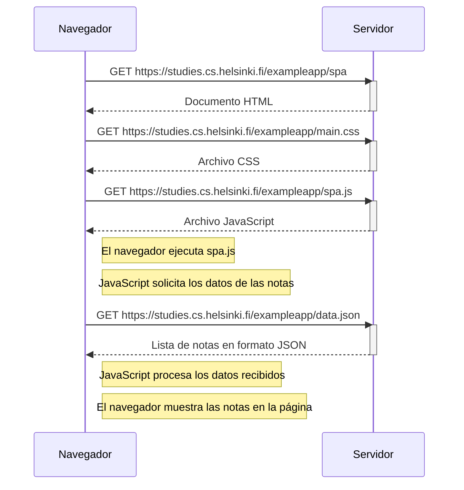

```mermaid
sequenceDiagram
    participant browser as Navegador
    participant server as Servidor

    browser->>server: GET https://studies.cs.helsinki.fi/exampleapp/spa
    activate server
    server-->>browser: Documento HTML
    deactivate server

    browser->>server: GET https://studies.cs.helsinki.fi/exampleapp/main.css
    activate server
    server-->>browser: Archivo CSS
    deactivate server

    browser->>server: GET https://studies.cs.helsinki.fi/exampleapp/spa.js
    activate server
    server-->>browser: Archivo JavaScript
    deactivate server

    Note right of browser: El navegador ejecuta spa.js
    Note right of browser: JavaScript solicita los datos de las notas

    browser->>server: GET https://studies.cs.helsinki.fi/exampleapp/data.json
    activate server
    server-->>browser: Lista de notas en formato JSON
    deactivate server

    Note right of browser: JavaScript procesa los datos recibidos
    Note right of browser: El navegador muestra las notas en la página
```
