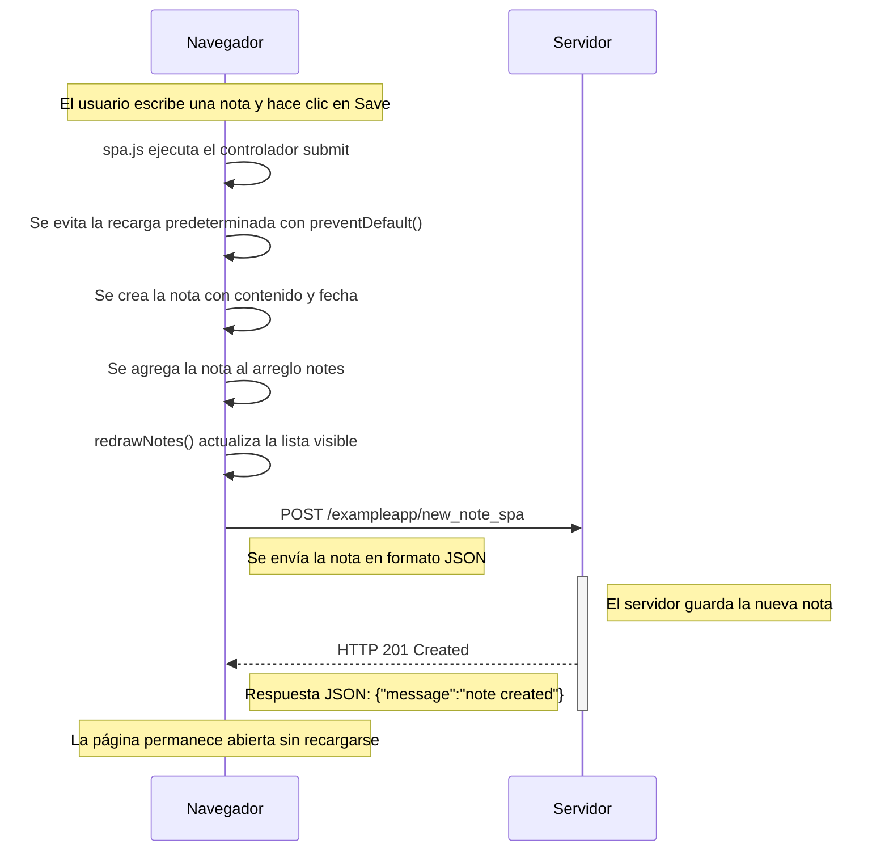

```mermaid
sequenceDiagram
    participant browser as Navegador
    participant server as Servidor

    Note over browser: El usuario escribe una nota y hace clic en Save

    browser->>browser: spa.js ejecuta el controlador submit
    browser->>browser: Se evita la recarga predeterminada con preventDefault()
    browser->>browser: Se crea la nota con contenido y fecha
    browser->>browser: Se agrega la nota al arreglo notes
    browser->>browser: redrawNotes() actualiza la lista visible

    browser->>server: POST /exampleapp/new_note_spa
    Note right of browser: Se envía la nota en formato JSON
    activate server
    Note right of server: El servidor guarda la nueva nota
    server-->>browser: HTTP 201 Created
    Note left of server: Respuesta JSON: {"message":"note created"}
    deactivate server

    Note over browser: La página permanece abierta sin recargarse
```
